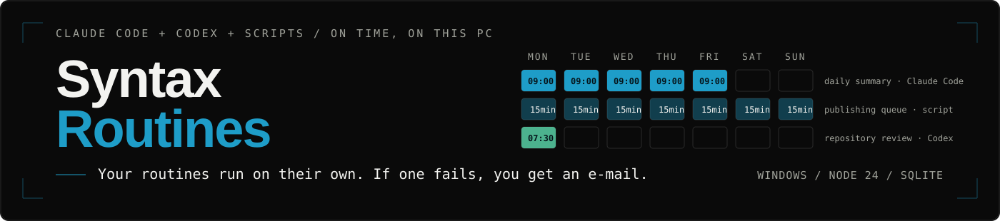
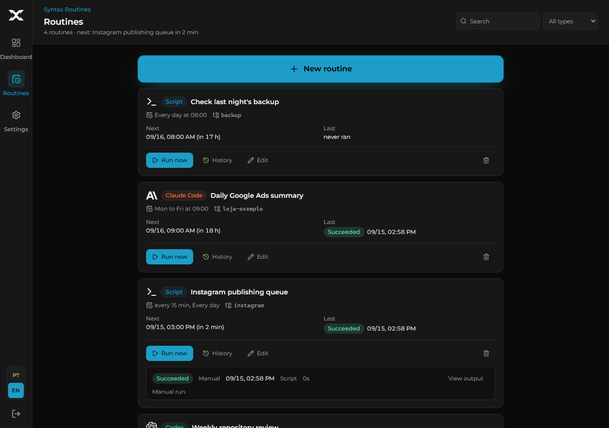
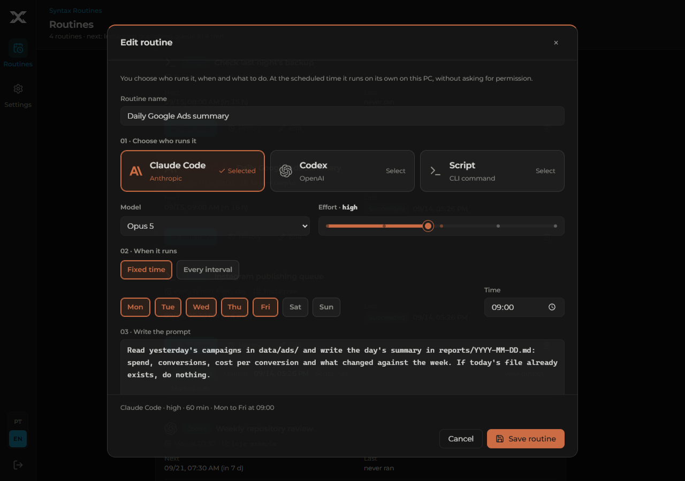
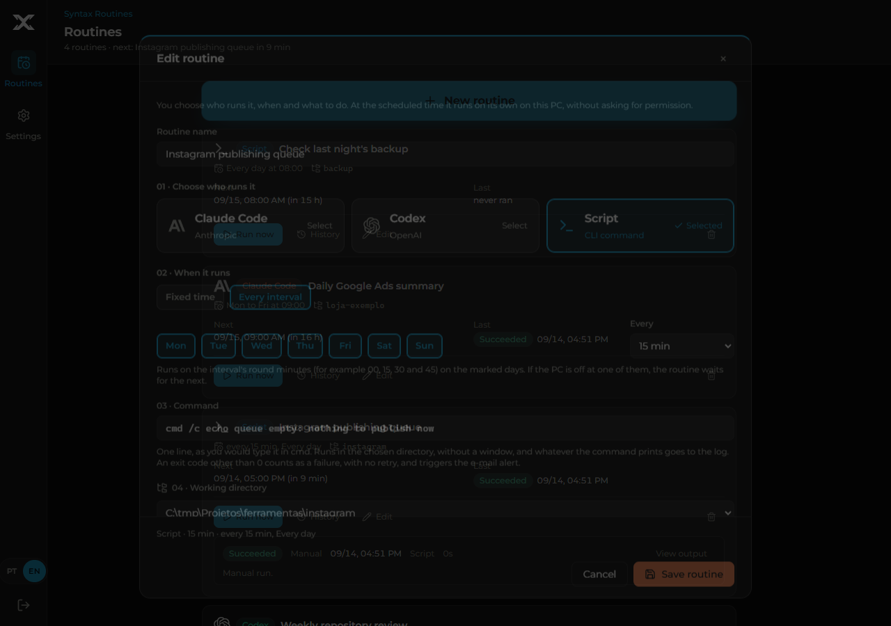
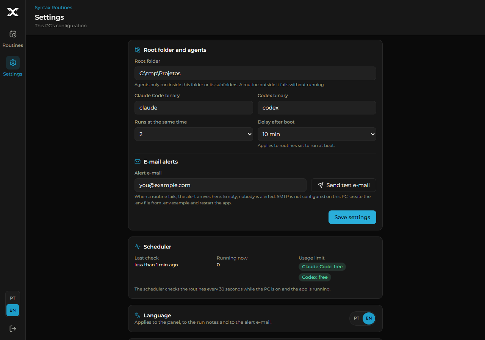

<p align="center">
  
</p>

<h1 align="center">Syntax Routines</h1>

<p align="center"><strong>Your Claude Code, Codex and script routines run on their own, on time, on this PC.</strong></p>

<p align="center">
  <a href="#installation">Install</a> ·
  <a href="https://routines.syntaxlab.com.br/en/">Website</a> ·
  <a href="skills/README.md">Agent skill</a> ·
  <a href="https://syntaxlab.com.br">SyntaxLab</a> ·
  <a href="README.pt-BR.md">Português do Brasil</a>
</p>

<p align="center">
  <a href="https://github.com/thalesholleben/syntax-routines/actions/workflows/ci.yml"></a>
  <a href="LICENSE"></a>
  <a href="#prerequisites"></a>
  <a href="#prerequisites"></a>
  <a href="skills/README.md"></a>
</p>

You register who runs it (Claude Code, Codex or a command line), the days, the time or the
interval, and what to do. At the scheduled time the app runs it on your PC, without asking for
permission, inside the folder you chose, and sends an e-mail when something fails. A locked
screen does not interrupt anything. There is no server, account or cloud: one local process,
one SQLite database and a panel on `127.0.0.1`.

> The panel is available in English and Brazilian Portuguese (selector on the sign-in screen and
> in the sidebar; the choice also drives run notes and alert e-mails). The CLI output and the agent
> skill are in Portuguese. A Portuguese version of this page is [README.pt-BR.md](README.pt-BR.md).

## Project status

In daily use since September 14, 2026, with seven routines migrated from the Windows Task
Scheduler (publishing pipelines, daily summaries and a backup check). The current version is
0.1. What is verified is what the gates prove on every commit: the vitest suite (scheduler on
a real SQLite file, migration, runner with fake CLIs and real scripts, HTTP, CLI), the Chrome
smoke with a fake agent, the PowerShell tests and gitleaks, all on `windows-latest`. There is
no support channel with a deadline; see [SUPPORT.md](SUPPORT.md).

## What it does

- **Three kinds of routine.** Claude Code and Codex receive a prompt and run with full access in
  the chosen directory, with the model and effort you set. **Script** receives one command line
  (as you would type it in cmd) and runs in the chosen directory, without a window; exit code 0
  succeeds, anything else fails.
- **Fixed time or interval.** "Mon to Fri at 09:00" or "every 15 min" (5 min to 12 h) on the
  marked days, on a grid aligned to midnight.
- **PC off at the scheduled time.** Each fixed-time routine chooses "skip this one" or "run at
  boot", with the delay set in Settings. Missed several times, only the latest counts.
- **Agent usage limits.** Up to three attempts. With "switch agent automatically" on, it falls
  back to the other agent; off, it waits for the reset time.
- **E-mail on failure.** Every run that ends in failure (exit code, timeout, exhausted limit,
  directory outside the root folder, app closed mid-run) produces an e-mail with the routine,
  the error and the panel link. Success stays quiet.
- **History and log** for every run, in the panel and through the CLI, kept for 30 days.
- **English or Portuguese.** A discreet selector on the sign-in screen and at the bottom of the
  sidebar switches the whole panel; the choice also applies to run notes and alert e-mails.
- **An agent looks after it for you.** The CLI and the skill let Claude Code or Codex read,
  suggest and, with your confirmation, register routines.

## Product preview

Demo data, generated by `node scripts/screenshots.mjs --lang en` on a disposable installation; no
real routine appears here. The panel switches between Portuguese and English with the selector at
the bottom of the sidebar (or on the sign-in screen).

### Routines



### Editing an agent routine



### Script routine on an interval



### Settings



## Prerequisites

- Windows 10 or 11.
- Node.js 24.13 or newer.
- `claude` and `codex` installed and authenticated for your Windows user (only for agent routines).
- Chrome or Edge, for the app-mode shortcut (optional).

## Installation

In a regular PowerShell, inside the project folder (no administrator needed):

```powershell
git clone https://github.com/thalesholleben/syntax-routines.git
cd syntax-routines
Copy-Item .env.example .env      # fill in the SMTP settings if you want e-mail alerts
.\service\install.ps1 -Build
```

The script installs dependencies, builds, registers the `SyntaxRoutines` scheduled task (starts
at your logon, no window, restarts if it dies) and creates the `Syntax Routines` shortcut on the
desktop. On first access you create the panel password; then, in Settings, set the root folder
and the notification e-mail.

- **Opens as an app, not a tab.** The shortcut launches Chrome (or Edge) with `--app=`, so the
  window has no address bar and shows the Syntax Routines icon in the taskbar.
- **E-mail.** `.env` takes `SMTP_HOST`, `SMTP_PORT`, `SMTP_SECURE`, `SMTP_USER`, `SMTP_PASS`,
  `MAIL_FROM_EMAIL` and `MAIL_FROM_NAME` (Gmail and Google Workspace defaults on 587 with
  STARTTLS; on Google with two-step verification, use an app password). Without the file the app
  starts without e-mail and Settings says so. "Send test e-mail" uses the same path as the
  failure alert. Changed `.env`: run `install.ps1` again, without `-Build`.
- The app only runs while your user is logged in: if the PC boots and nobody signs in, routines
  wait for the logon. A locked screen does not interrupt anything.
- Remove: `.\service\uninstall.ps1`. Data in `data/` stays.
- Without the scheduled task: `npm install`, `npm run build`, then `start.cmd`.

## Let an agent look after the routines

The app ships a CLI and a skill for Claude Code and Codex. With both installed, the agent sees
the routines, suggests scheduling what you repeat, and registers it after you say yes.

```powershell
.\routines.cmd list                 # routines, schedule, next run and how the last one ended
.\routines.cmd runs 4 --limit 5     # history of one routine
.\routines.cmd log 187              # the output of one run
.\routines.cmd add rotina.json      # create (the agent only does this after your confirmation)
```

`list`, `show`, `settings`, `runs` and `log` read; `add`, `edit`, `enable`, `disable`, `run-now`
and `rm` write. Reads accept `--json`, validation is the same as the API routes, and no panel
password is needed. `routines.cmd --help` shows everything.

The skill is what makes the agent use this on its own, and it is what forbids creating,
changing or deleting a routine without your confirmation. In Claude Code, with no clone:

```
/plugin marketplace add thalesholleben/syntax-routines
/plugin install syntax-routines@syntax-routines
```

For Codex, or from a clone (or the app folder itself): `node scripts/install-skill.mjs codex`.
Details, manual installation and what the skill teaches: [skills/README.md](skills/README.md).

## Bundled tools

**Import routines from a file.** To register several at once (or migrate Windows Task Scheduler
tasks), write a JSON in the format of
[docs/exemplos/rotinas-exemplo.json](docs/exemplos/rotinas-exemplo.json) and run
`npm run import -- path\to\rotinas.json`. Same validation as the routes, `directory` resolved
against the root folder, the whole file is refused if any item is invalid, and routines whose
name already exists are skipped.

Migrating a Task Scheduler task: register the script routine with the same command and
directory, run it once with "Run now", **disable** the old task (`Disable-ScheduledTask`) so it
does not run twice, and only remove it after one green cycle.

**Check a backup.** `scripts/check-backup.ps1` reads a backup `latest.json` (fields `status`,
`started_at`, `error`) and exits with 1 when the last backup failed, is too old or is stuck in
`running`. Registered as a daily script routine, it becomes an e-mail alert when the backup did
not work:

```
powershell -NoProfile -ExecutionPolicy Bypass -File scripts\check-backup.ps1 -LatestJson D:\Backups\logs\latest.json
```

## Why this project exists

People who work with coding agents accumulate work that repeats: the summary every morning,
the queue that must be checked every 15 minutes, the weekly repository sweep. Leaving it in
Task Scheduler scatters logic across `.ps1` files nobody remembers, and leaving it in the chat
means asking again every week. Syntax Routines puts all of it in one place, with history,
failure alerts and a CLI the agent itself knows how to use.

Commercially it is an extension of Syntax Ops, SyntaxLab's panel for dispatching work to
agents. Technically it is independent: its own repository, database and process, with no
dependency on any other product. The audience is anyone who runs Claude Code or Codex daily and
wants part of that work to happen with nobody watching.

## Architecture at a glance

| Layer | Technology | Responsibility |
| --- | --- | --- |
| Panel | React 19, Vite, Tailwind 4 | Login, routines, history, settings |
| API and scheduler | Express 5, `node:sqlite` | Session, validation (zod), 30 s tick, queue, retry, retention |
| Executors | `claude`, `codex`, `cmd.exe` | Prompt over stdin with permission bypass, or a command line |
| E-mail | nodemailer | Failure alert through the SMTP in `.env` |
| Installation | PowerShell, Windows Task Scheduler | Logon task without elevation, app-mode shortcut |
| Agent | CLI (`dist/routines.mjs`) + skill | Reads and writes through the same path as the routes, no password |

The scheduler materializes the occurrences since the last tick, applies the PC-off policy and
dispatches with an atomic claim (one run per routine, a global parallelism cap). More in
[AGENTS.md](AGENTS.md), which lists the invariants that must not break.

## Development

| Command | What it does |
| --- | --- |
| `npm run dev` | API with reload (`--dev`) + Vite panel at http://127.0.0.1:5190 |
| `npm run typecheck` | TypeScript for the server, the client and `scripts/` |
| `npm test` | vitest: schedule, scheduler with real SQLite, migration, runner with fake `.cmd` and real scripts, e-mail with a fake transport, HTTP, boot, import and CLI |
| `npm run build` | typecheck + `dist/client` + `dist/server/index.mjs` + `dist/routines.mjs` |
| `npm run e2e` | smoke in the installed Chrome with a fake agent and a real script (needs the build; captures in `e2e/.output`) |
| `npm run test:ps1` | `service/listener.test.ps1` (real processes on a free port, no admin) and `scripts/check-backup.test.ps1` |
| `npm run skills:check` | checks the skill packages against the real CLI (a documented command that does not exist fails) |
| `npm run routines -- <cmd>` | the CLI in development, without the build |
| `node scripts/screenshots.mjs` | regenerates the README images on a disposable installation (`--lang en` for this page's) |
| `node scripts/make-icons.mjs` | regenerates the app icons from `public/brand/syntax-x.svg` |

Tests and e2e use only temporary folders, never touch `data/`, never call the real Claude or
Codex and never send e-mail (the e2e clears `SMTP_*` from the environment and points
`ENV_FILE` at an empty file). CI runs all of it on `windows-latest` and runs gitleaks over the
history.

## Security model

- The server listens only on `127.0.0.1`, requires a password (scrypt) for everything except
  `GET /api/auth/state`, `POST /api/auth/setup` and `POST /api/auth/login`, and guards `Host` and
  `Origin` on the whole API.
- Whoever has the panel password, or access to the app folder, launches Claude Code and Codex
  with `--dangerously-skip-permissions` and arbitrary commands on the PC, inside the root folder.
  The panel is an execution surface: treat the password like your Windows password.
- Directories are always resolved to their real path: a junction or symlink pointing outside the
  root folder is refused, and system folders are blocked.
- The only secret (SMTP) lives in `.env`, outside git; the alert recipient lives in the database.

Vulnerability reports: [SECURITY.md](SECURITY.md). Do not open a public issue for those.

## Repository map

```text
server/src/   Express 5 API, scheduler, CLI and script runner, e-mail, node:sqlite database
client/src/   React 19 + Tailwind 4 panel (Login, Routines, Settings)
scripts/      agent CLI, import, skill (install and check), check-backup.ps1, screenshots and icons
skills/       skill packages for Claude Code and Codex, installable from here
service/      install.ps1 and uninstall.ps1 for the scheduled task
e2e/          Chrome smoke and fake agent
public/       app-mode manifest, brand and icons
docs/         examples, README images and the CSS namespace registry
```

## Documentation

- [Invariants and commands for agents changing the code](AGENTS.md)
- [Agent skill and how to install it](skills/README.md)
- [Import file example](docs/exemplos/rotinas-exemplo.json)
- [Changelog](CHANGELOG.md)
- [Contributing](CONTRIBUTING.md) and [support](SUPPORT.md)

## Contributing

Issues and pull requests are welcome. Code changes go through the gates in
[Development](#development); a CLI change updates the skill reference in the same commit, or
`npm run skills:check` fails. Read [CONTRIBUTING.md](CONTRIBUTING.md) and [AGENTS.md](AGENTS.md)
before opening a PR.

## License

[MIT](LICENSE) © 2026 SyntaxLab Tecnologia LTDA.
