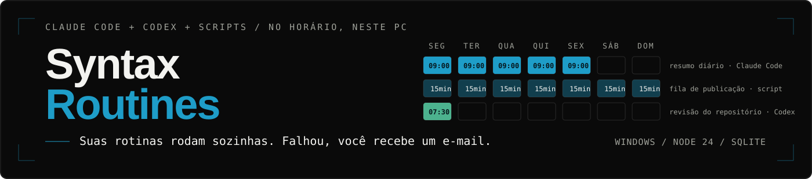
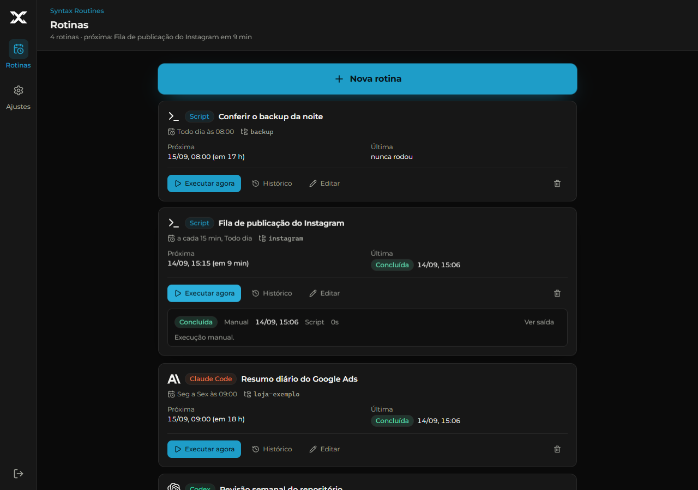
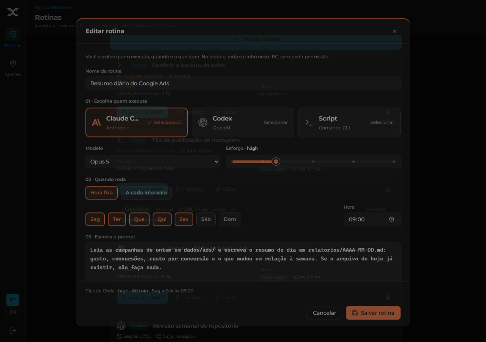
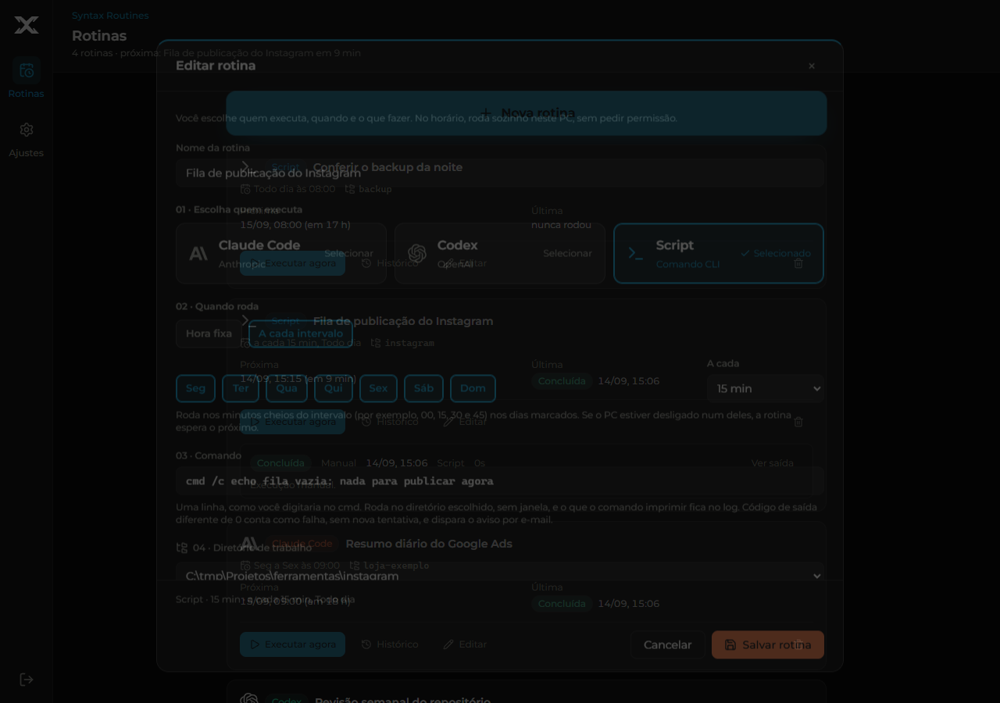
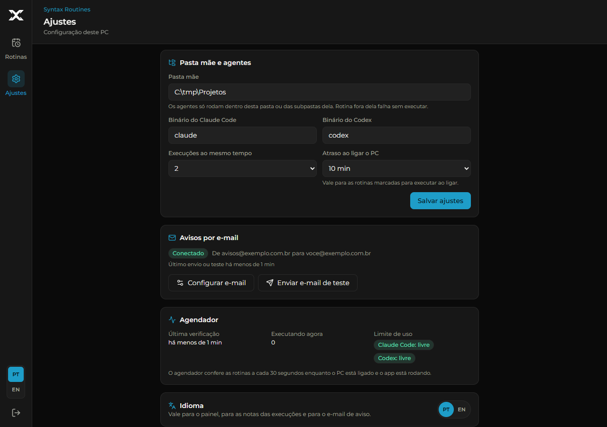

<p align="center">
  
</p>

<h1 align="center">Syntax Routines</h1>

<p align="center"><strong>Suas rotinas de Claude Code, Codex e scripts rodam sozinhas, no horário certo, neste PC.</strong></p>

<p align="center">
  <a href="#instalação">Instalar</a> ·
  <a href="https://routines.syntaxlab.com.br">Site</a> ·
  <a href="skills/README.md">Skill para o agente</a> ·
  <a href="https://syntaxlab.com.br">SyntaxLab</a> ·
  <a href="README.md">English</a>
</p>

<p align="center">
  <a href="https://github.com/thalesholleben/syntax-routines/actions/workflows/ci.yml"></a>
  <a href="LICENSE"></a>
  <a href="#pré-requisitos"></a>
  <a href="#pré-requisitos"></a>
  <a href="skills/README.md"></a>
</p>

Você cadastra quem executa (Claude Code, Codex ou uma linha de comando), os dias, a hora ou o
intervalo e o que fazer. No horário, o app executa no seu PC, sem pedir permissão, dentro da
pasta que você escolheu, e manda um e-mail quando algo falha. Tela bloqueada não interrompe
nada. Não existe servidor, conta nem nuvem: um processo local, um banco SQLite e um painel em
`127.0.0.1`.

## Estado do projeto

Em uso diário desde 14/09/2026, com sete rotinas migradas do Agendador de Tarefas do Windows
(esteiras de publicação, resumos diários e conferência de backup). A versão atual é a 0.1. O que
está verificado é o que os gates provam a cada commit: a suíte do vitest (agendador sobre um
SQLite real, migração, runner com CLIs falsos e scripts reais, HTTP, CLI), o smoke no Chrome com
agente falso, os testes de PowerShell e o gitleaks, tudo em `windows-latest`. Não há canal de
suporte com prazo; veja [SUPPORT.md](SUPPORT.md).

## O que ele faz

- **Três tipos de rotina.** Claude Code e Codex recebem um prompt e rodam com acesso total no
  diretório escolhido, com o modelo e o esforço que você definiu. **Script** recebe uma linha
  de comando (como você digitaria no cmd) e roda no diretório escolhido, sem janela; código de
  saída 0 conclui, qualquer outro é falha.
- **Hora fixa ou intervalo.** "Seg a Sex às 09:00" ou "a cada 15 min" (de 5 min a 12 h) nos dias
  marcados, na grade alinhada à meia-noite.
- **PC desligado no horário.** Cada rotina de hora fixa escolhe "Pular esta vez" ou "Executar ao
  ligar", com o atraso definido em Ajustes. Perdeu várias vezes, só a mais recente conta.
- **Limite de uso dos agentes.** Até três tentativas. Com "Trocar de agente automaticamente"
  ligado, cai para o outro agente; desligado, espera o horário de reset.
- **Aviso por e-mail.** Toda execução que termina em falha (código de saída, timeout, limite
  esgotado, diretório fora da pasta mãe, app encerrado no meio) gera um e-mail com a rotina, o
  erro e o link do painel. Sucesso não avisa. A conta que envia é configurada num modal em Ajustes
  (Gmail com senha de app, ou qualquer servidor SMTP), testada ao salvar, com um selo que diz
  Conectado ou por que falhou.
- **Histórico e log** de cada execução no painel e pelo CLI, com retenção de 30 dias.
- **Português ou inglês.** Um seletor discreto na tela de login e no pé da barra lateral troca o
  painel inteiro; a escolha vale também para as notas das execuções e para o e-mail de aviso.
- **Um agente cuida disso por você.** O CLI e a skill deixam o Claude Code ou o Codex consultar,
  sugerir e, com a sua confirmação, cadastrar rotinas.

## Prévia do produto

Dados de demonstração, gerados por `node scripts/screenshots.mjs` em uma instalação
descartável; nenhuma rotina real aparece aqui. As mesmas telas em inglês estão no
[README.md](README.md).

### Rotinas



### Nova rotina de agente



### Rotina de script por intervalo



### Ajustes



## Pré-requisitos

- Windows 10 ou 11.
- Node.js 24.13 ou mais novo.
- `claude` e `codex` instalados e autenticados no seu usuário do Windows (só para rotinas de agente).
- Chrome ou Edge, para o atalho em modo app (opcional).

## Instalação

Em um PowerShell comum, na pasta do projeto (não precisa de administrador):

```powershell
git clone https://github.com/thalesholleben/syntax-routines.git
cd syntax-routines
.\service\install.ps1 -Build
```

O script instala as dependências, gera o build, registra a tarefa agendada `SyntaxRoutines`
(sobe no logon do seu usuário, sem janela, reinicia se cair) e cria o atalho `Syntax Routines`
na área de trabalho. No primeiro acesso você cria a senha do painel; depois, em Ajustes, define
a pasta mãe e clica em **Configurar e-mail**.

- **Abre como app, não como aba.** O atalho chama o Chrome (ou o Edge) em `--app=`, então a
  janela vem sem barra de endereço e com o ícone do Syntax Routines na barra de tarefas.
- **E-mail.** Em Ajustes, **Configurar e-mail** abre um modal: Gmail (com senha de app, que exige
  a verificação em duas etapas) ou outro servidor SMTP, o e-mail que envia e quem recebe os avisos.
  Ao salvar, o app testa a conexão antes; o selo mostra Conectado, Falhou com o motivo ou Não
  testado, e os avisos de verdade também o atualizam. A senha fica cifrada com a DPAPI do Windows
  para o seu usuário e nunca volta pela API nem pelo CLI. O botão "Enviar e-mail de teste" usa o
  mesmo caminho do aviso de falha.
- **E-mail pelo `.env` (opcional).** `SMTP_HOST`, `SMTP_PORT`, `SMTP_SECURE`, `SMTP_USER`,
  `SMTP_PASS`, `MAIL_FROM_EMAIL` e `MAIL_FROM_NAME` continuam valendo (copie o `.env.example` para
  `.env`); a conta salva no painel tem prioridade. Mudou o `.env`: rode `install.ps1` de novo, sem
  `-Build`.
- O app só roda com o seu usuário logado: se o PC ligar e ninguém entrar, as rotinas esperam o
  logon. Tela bloqueada não interrompe nada.
- Remover: `.\service\uninstall.ps1`. Os dados em `data/` ficam.
- Sem instalar a tarefa: `npm install`, `npm run build` e depois `start.cmd`.

## Deixar um agente cuidar das rotinas

O app tem um CLI e uma skill para Claude Code e Codex. Com os dois instalados, o agente enxerga
as rotinas, sugere agendar o que você repete e cadastra depois que você autoriza.

```powershell
.\routines.cmd list                 # rotinas, agenda, próxima execução e como terminou a última
.\routines.cmd runs 4 --limit 5     # histórico de uma rotina
.\routines.cmd log 187              # a saída de uma execução
.\routines.cmd add rotina.json      # cria (o agente só faz isso depois do seu sim)
```

`list`, `show`, `settings`, `runs` e `log` leem; `add`, `edit`, `enable`, `disable`, `run-now` e
`rm` escrevem. Aceita `--json` nas leituras, usa a mesma validação das rotas da API e não pede a
senha do painel. `routines.cmd --help` mostra tudo.

A skill é o que faz o agente usar isso sozinho, e é ela que proíbe criar, alterar ou apagar
rotina sem a sua confirmação. Em Claude Code, sem clonar nada:

```
/plugin marketplace add thalesholleben/syntax-routines
/plugin install syntax-routines@syntax-routines
```

Para o Codex, ou a partir de um clone (ou da própria pasta do app): `node scripts/install-skill.mjs codex`.
Detalhes, instalação manual e o que a skill ensina: [skills/README.md](skills/README.md).

## Ferramentas incluídas

**Importar rotinas de um arquivo.** Para cadastrar várias de uma vez (ou migrar tarefas do
Agendador do Windows), escreva um JSON no formato de
[docs/exemplos/rotinas-exemplo.json](docs/exemplos/rotinas-exemplo.json) e rode
`npm run import -- caminho\para\rotinas.json`. Usa a mesma validação das rotas, resolve
`directory` relativo à pasta mãe, recusa o arquivo inteiro se qualquer item for inválido e pula
rotina com nome já existente.

Migrando uma tarefa do Agendador do Windows: cadastre a rotina de script com o mesmo comando e
diretório, execute uma vez por "Executar agora", **desative** a tarefa antiga
(`Disable-ScheduledTask`) para não rodar em dobro, e só a remova depois de um ciclo verde.

**Conferir um backup.** `scripts/check-backup.ps1` lê um `latest.json` de backup (campos
`status`, `started_at`, `error`) e sai com 1 quando o último backup falhou, está velho demais ou
travou em `running`. Cadastrado como rotina de script diária, vira aviso por e-mail quando o
backup não funcionou:

```
powershell -NoProfile -ExecutionPolicy Bypass -File scripts\check-backup.ps1 -LatestJson D:\Backups\logs\latest.json
```

## Por que este projeto existe

Quem trabalha com agentes de código acumula trabalho que se repete: o resumo de toda manhã, a
fila que precisa ser conferida a cada 15 minutos, a varredura semanal do repositório. Deixar
isso no Agendador de Tarefas espalha lógica por `.ps1` que ninguém lembra de onde veio, e
deixar no chat significa pedir de novo toda semana. O Syntax Routines coloca tudo em um lugar
só, com histórico, aviso de falha e um CLI que o próprio agente sabe usar.

Comercialmente é uma extensão do Syntax Ops, o painel da SyntaxLab para despachar trabalho a
agentes. Tecnicamente é independente: repositório, banco e processo próprios, sem nenhuma
dependência de outro produto. O público é quem opera Claude Code ou Codex no dia a dia e quer
que parte desse trabalho aconteça sem ninguém olhando.

## Arquitetura em uma olhada

| Camada | Tecnologia | Responsabilidade |
| --- | --- | --- |
| Painel | React 19, Vite, Tailwind 4 | Login, rotinas, histórico, ajustes |
| API e agendador | Express 5, `node:sqlite` | Sessão, validação (zod), tick de 30 s, fila, retry, retenção |
| Executores | `claude`, `codex`, `cmd.exe` | Prompt por stdin com bypass de permissões, ou linha de comando |
| E-mail | nodemailer, DPAPI do Windows | Aviso de falha pela conta SMTP salva em Ajustes (ou do `.env`) |
| Instalação | PowerShell, Agendador do Windows | Tarefa no logon, sem elevação, atalho em modo app |
| Agente | CLI (`dist/routines.mjs`) + skill | Leitura e escrita pelo mesmo caminho das rotas, sem senha |

O agendador materializa as ocorrências desde o último tick, aplica a política de PC desligado
e despacha com um claim atômico (uma execução por rotina, teto global de paralelismo). Mais em
[AGENTS.md](AGENTS.md), que lista as invariantes que não se quebram.

## Desenvolvimento

| Comando | O que faz |
| --- | --- |
| `npm run dev` | API com reload (`--dev`) + painel Vite em http://127.0.0.1:5190 |
| `npm run typecheck` | TypeScript do servidor, do cliente e de `scripts/` |
| `npm test` | vitest: agenda, agendador com SQLite real, migração, runner com `.cmd` falsos e scripts reais, e-mail com transporte falso e DPAPI de verdade, HTTP, subida, importação e CLI |
| `npm run build` | typecheck + `dist/client` + `dist/server/index.mjs` + `dist/routines.mjs` |
| `npm run e2e` | smoke no Chrome instalado com agente falso, script real e um SMTP falso local (precisa do build; capturas em `e2e/.output`) |
| `npm run test:ps1` | `service/listener.test.ps1` (processos reais numa porta livre, sem admin) e `scripts/check-backup.test.ps1` |
| `npm run skills:check` | confere os pacotes de skill contra o CLI de verdade (comando documentado que não existe reprova) |
| `npm run routines -- <cmd>` | o CLI em desenvolvimento, sem precisar do build |
| `node scripts/screenshots.mjs` | regera as imagens deste README numa instalação descartável (`--lang en` para as do README em inglês) |
| `node scripts/make-icons.mjs` | regera os ícones do app a partir de `public/brand/syntax-x.svg` |

Testes e e2e usam só pastas temporárias, não tocam em `data/`, não chamam Claude ou Codex de
verdade e não mandam e-mail (o e2e limpa `SMTP_*` do ambiente, aponta `ENV_FILE` para um
arquivo vazio e configura o e-mail contra um SMTP falso em 127.0.0.1). O CI roda tudo isso em `windows-latest` e passa o gitleaks no histórico.

## Modelo de segurança

- O servidor escuta só em `127.0.0.1`, exige uma senha (scrypt) para tudo além de
  `GET /api/auth/state`, `POST /api/auth/setup` e `POST /api/auth/login`, e guarda `Host` e
  `Origin` em toda a API.
- Quem tem a senha do painel, ou acesso à pasta do app, dispara Claude Code e Codex com
  `--dangerously-skip-permissions` e comandos arbitrários no PC, dentro da pasta mãe. O painel é
  uma superfície de execução: trate a senha como a senha do próprio Windows.
- Diretório sempre por caminho real: junction ou symlink para fora da pasta mãe é recusado, e
  pastas do sistema são bloqueadas.
- O único segredo é a senha do SMTP. Salva em Ajustes, ela é cifrada com a DPAPI do Windows
  (usuário atual) antes de chegar ao banco e nunca sai do servidor; no `.env`, fica fora do git. O
  destinatário dos avisos fica no banco.

Relato de vulnerabilidade: [SECURITY.md](SECURITY.md). Não abra issue pública para isso.

## Mapa do repositório

```text
server/src/   API Express 5, agendador, runner dos CLIs e de scripts, e-mail, banco node:sqlite
client/src/   painel React 19 + Tailwind 4 (Login, Rotinas, Ajustes)
scripts/      CLI do agente, importação, skill (install e check), check-backup.ps1, capturas e ícones
skills/       pacotes de skill do Claude Code e do Codex, instaláveis daqui
service/      install.ps1 e uninstall.ps1 da tarefa agendada
e2e/          smoke no Chrome e agente falso
public/       manifesto do modo app, marca e ícones
docs/         exemplos, imagens do README e registro de namespaces CSS
```

## Documentação

- [Invariantes e comandos para agentes que mexem no código](AGENTS.md)
- [Skill para o agente e como instalar](skills/README.md)
- [Exemplo de arquivo de importação](docs/exemplos/rotinas-exemplo.json)
- [Histórico de versões](CHANGELOG.md)
- [Como contribuir](CONTRIBUTING.md) e [suporte](SUPPORT.md)

## Contribuição

Issues e pull requests são bem-vindos. Mudança em código passa pelos gates de
[Desenvolvimento](#desenvolvimento); mudança no CLI atualiza a referência da skill no mesmo
commit, ou `npm run skills:check` reprova. Leia [CONTRIBUTING.md](CONTRIBUTING.md) e
[AGENTS.md](AGENTS.md) antes de abrir um PR.

## Licença

[MIT](LICENSE) © 2026 SyntaxLab Tecnologia LTDA.
